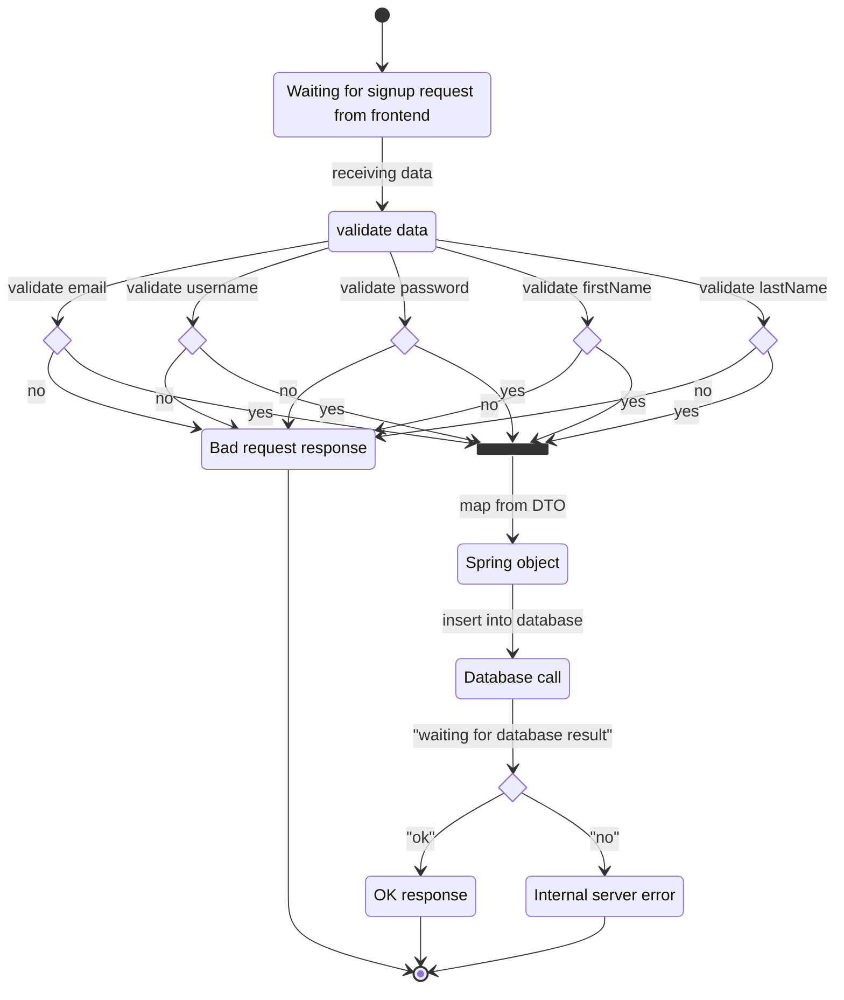

```mermaid
stateDiagram-v2

state "Waiting for signup request from frontend" as Idle
state "validate data" as validation
state email_validated <<choice>>
state username_validated <<choice>>
state password_validated <<choice>>
state firstName_validated <<choice>>
state lastName_validated <<choice>>
state db_result <<choice>>
state validated <<fork>>

state "Spring object" as spring_object
state "Database call" as db

state "Bad request response" as bad_request
state "OK response" as ok
state "Internal server error" as internal_server_error

[*] --> Idle
Idle --> validation : receiving data

validation --> email_validated : validate email
email_validated --> bad_request : no
email_validated --> validated : yes

validation --> username_validated : validate username
username_validated --> bad_request : no
username_validated  --> validated : yes

validation --> password_validated : validate password
password_validated --> bad_request : no
password_validated  --> validated : yes

validation --> firstName_validated : validate firstName
firstName_validated --> bad_request : no
firstName_validated  --> validated : yes

validation --> lastName_validated : validate lastName
lastName_validated --> bad_request : no
lastName_validated  --> validated : yes

validated --> spring_object : map from DTO
spring_object --> db : insert into database

db --> db_result : "waiting for database result"

db_result --> ok : "ok"
db_result --> internal_server_error : "no"

ok --> [*]
bad_request --> [*]
internal_server_error --> [*]

```