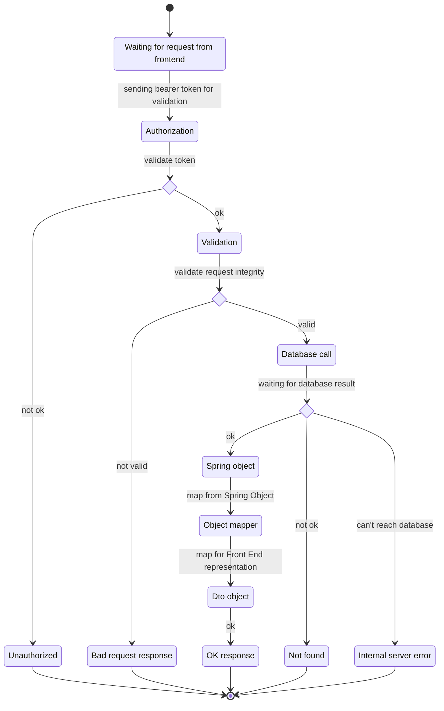

```mermaid
stateDiagram-v2

state "Authorization" as auth
state auth_result <<choice>>

state "Waiting for request from frontend" as Idle
state "Validation" as validation
state data_validated_choice <<choice>>
state db_result <<choice>>

state "Dto object" as output_dto_object
state "Spring object" as spring_object
state "Object mapper" as output_object_mapper
state "Database call" as db

state "Bad request response" as bad_request
state "OK response" as ok
state "Internal server error" as internal_server_error
state "Not found" as not_found
state "Unauthorized" as unauthorized

[*] --> Idle

Idle --> auth : sending bearer token for validation
auth --> auth_result : validate token

auth_result --> unauthorized : not ok
auth_result --> validation : ok

validation --> data_validated_choice : validate request integrity

data_validated_choice --> bad_request : not valid
data_validated_choice --> db : valid

db --> db_result : waiting for database result

db_result --> spring_object : ok
db_result --> not_found : not ok
db_result --> internal_server_error : can't reach database

spring_object --> output_object_mapper : map from Spring Object
output_object_mapper--> output_dto_object : map for Front End representation

output_dto_object --> ok : ok

not_found --> [*]
ok --> [*]
bad_request --> [*]
internal_server_error --> [*]
unauthorized --> [*]

```