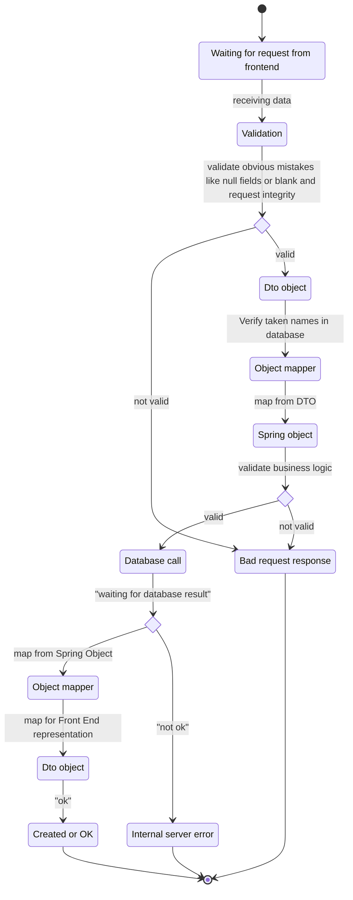

```mermaid
stateDiagram-v2

state "Waiting for request from frontend" as Idle
state "Validation" as validation
state data_validated_choice <<choice>>
state business_logic_validated <<choice>>
state db_result <<choice>>

state "Dto object" as input_dto_object
state "Dto object" as output_dto_object
state "Spring object" as spring_object
state "Object mapper" as input_object_mapper
state "Object mapper" as output_object_mapper
state "Database call" as db

state "Bad request response" as bad_request
state "Created or OK" as ok
state "Internal server error" as internal_server_error

[*] --> Idle

Idle --> validation : receiving data

validation --> data_validated_choice : validate obvious mistakes like null fields or blank and request integrity
data_validated_choice --> bad_request : not valid
data_validated_choice --> input_dto_object : valid

input_dto_object --> input_object_mapper : Verify taken names in database

input_object_mapper --> spring_object : map from DTO
spring_object --> business_logic_validated : validate business logic

business_logic_validated --> db : valid
business_logic_validated --> bad_request : not valid

db --> db_result : "waiting for database result"

db_result --> output_object_mapper : map from Spring Object
db_result --> internal_server_error : "not ok"

output_object_mapper --> output_dto_object : map for Front End representation

output_dto_object --> ok : "ok"

ok --> [*]
bad_request --> [*]
internal_server_error --> [*]

```